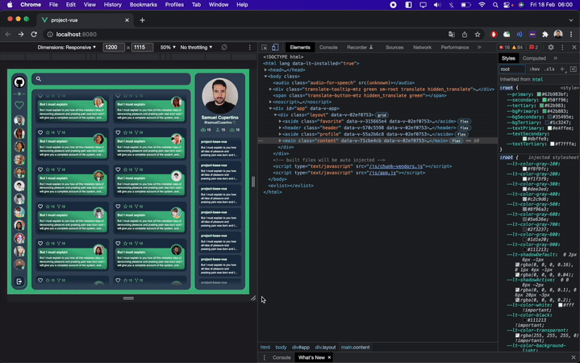

# About This Project ([video](https://www.instagram.com/p/CaHVBMhOL_s))
<table>
    <tr>
        <td>
          
        </td>
        <td>
            <h2>Technologies</h2>
            <ul>
                <li>Vue.js</li>
                <li>Nuxt.js</li>
                <li>Atomic Design</li>
                <li>HTML, CSS, JS...</li>
            </ul>
        </td>
    </tr>
    <tr>
        <td>
            <h2>Toggle Theme</h2>
            <ul>
                <li>CSS variables</li>
                <li>Local Storage</li>
                <li>JavaScript</li>
            </ul>
        </td>
        <td>
          
        </td>
    </tr>
    <tr>
        <td>
          
        </td>
        <td>
            <h2>Responsive</h2>
            <ul>
                <li>Fluid Responsive</li>
                <li>Infinite Responsive</li>
                <li>Grid Layout</li>
                <li>Flexible Box Layout</li>
            </ul>
        </td>
    </tr>
</table>

<br/>

## Start Project 
```bash
# install dependencies
yarn install
```
```bash
# serve with hot reload at localhost:3000
yarn dev
```
